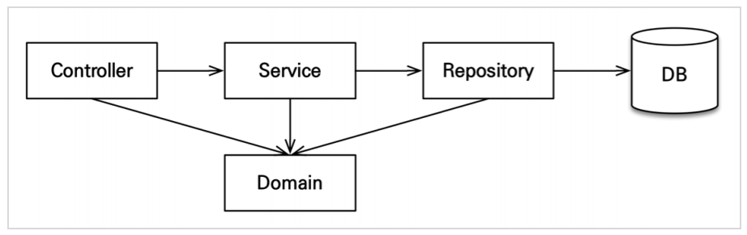
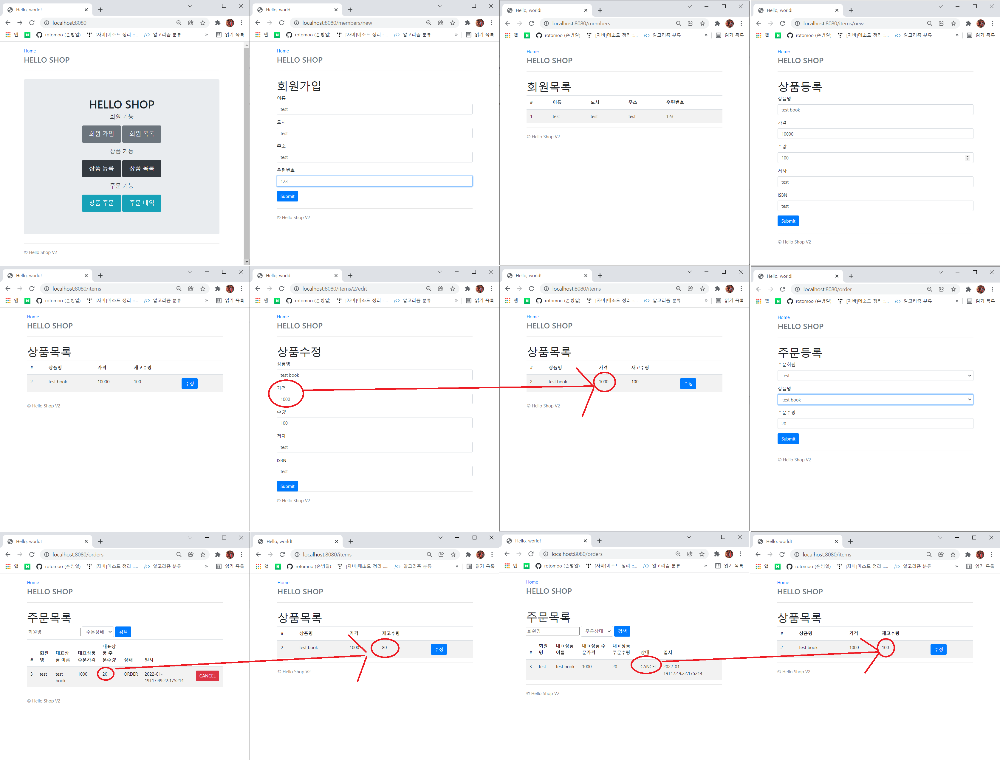
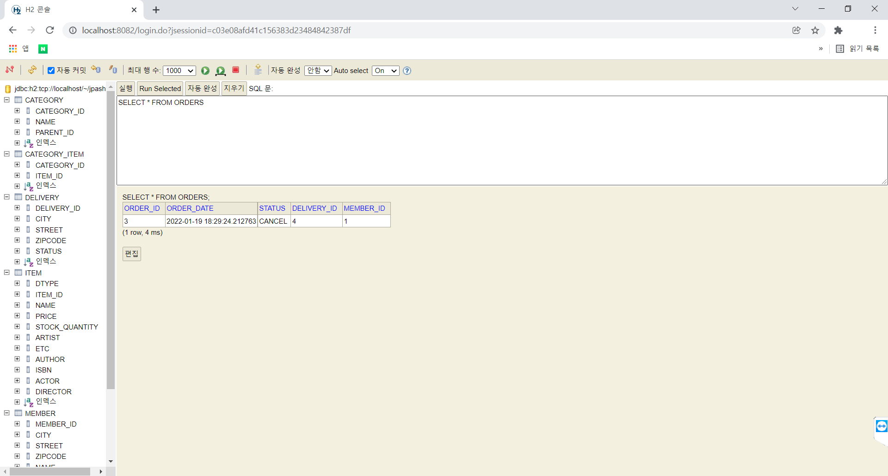

[인프런] 스프링 부트 JPA
======================
# 1. 웹 설명
## ▶ 웹 설명
	1. 개발 환경 - Spring Boot 2.6.2, java 11 Version, h2 Database 1.4.200
    2. 핵심 라이브러리 - 스프링 MVC, 스프링 ORM, JPA, 하이버네이트, 스프링데이터 JPA
    3. 기타 라이브러리 - H2 데이터베이스, thymeleaf, 로깅 SLF4J, 테스트(junit4)
    4. 회원, 상품, 주문 기능 웹 개발

****
# 2. 애플리케이션 아키텍처
## ▶ 계층형 구조 사용

```
/src
    /main : 메인 웹
        /java
            /...
                /controller : 웹 계층
                /service : 비즈니스 로직, 트랜잭션 처리
                /repository : JPA를 직접 사용하는 계층, 엔티티 매니저 사용
                /domain : 엔티티가 모여 있는 계층, 모든 계층에서 사용
                /exception : 공통 예외 설정
                
        /reources : 웹 계층
            /static : css, js
            /templates : thymeleaf 사용 html
            
    /test : 메인 웹 테스트
        /java
            /...
                /repository : 리포지토리 테스트
                /service : 서비스 테스트
                
        /reources : 테스트 DB서버
```
## ▶ 개발 순서
    1. 도메인 개발
	2. 리포지토리, 서비스 계층 개발
    3. 테스트 케이스를 작성 검증
    4. 웹 계층 적용

****
## 3. 웹 이미지
### 웹

### DB

****
## 4. 출처
#### 인프런 김영한 강사님의 '실전! 스프링 부트와 JPA 활용1 - 웹 애플리케이션 개발' 강의를 참고하여 개발하였습니다.